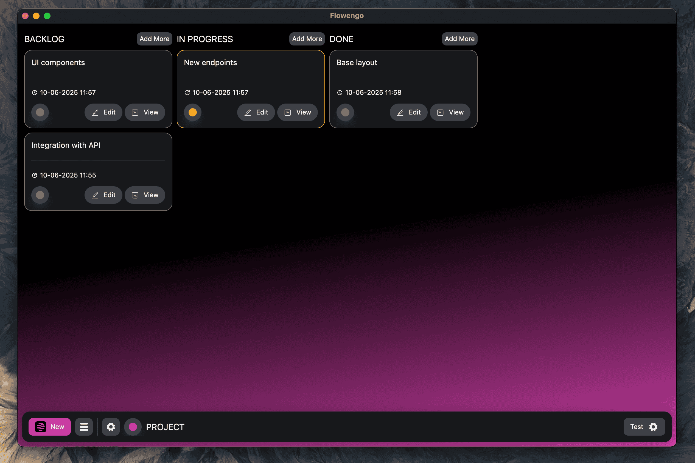

## Flowengo

Flowengo is a clean, fast, and minimalist desktop application for managing tasks with a Kanban-style board. Whether you're planning personal goals, managing work projects, or organizing your daily to-dos, Flowengo helps you stay focused and in control.

Create boards, add task cards, move them across customizable columns, and track your progress—all without distractions, right on your desktop.

---

### Crypto

We use cryptography when storing your data on disk.


### Common board

- Fast and intuitive interface.
- Easy navigation
- Moving tasks between columns




### Several boards

- Create multiple projects
- Create custom columns
- Rename them and swap them out.
- Free switching between projects


### Task handling

- Create, modify, move, remove, view tasks
- Use Rich editor for detailed task descriptions


### Theme

- Light and dark mode
- You can use the system theme if your device supports it


---


### FAQ

#### I forgot my password

You can reset all data along with your account. This can be done by selecting “Drop user data” from the system menu

#### Can I recover my data if I lose my password?

Since we can't verify the authenticity of your face. The only options are to reset your data or enter the correct password

---

### Tech Stack

**Client:** React, TailwindCSS, TS, Electron

---

### Development

### Install

```bash
$ npm install
```

### Development

```bash
$ npm run dev
```

### Build

```bash
# For windows
$ npm run build:win

# For macOS
$ npm run build:mac

# For Linux
$ npm run build:linux
```

> Node: v22.13.0 Npm: 10.9.2 Rust: 1.86.0
